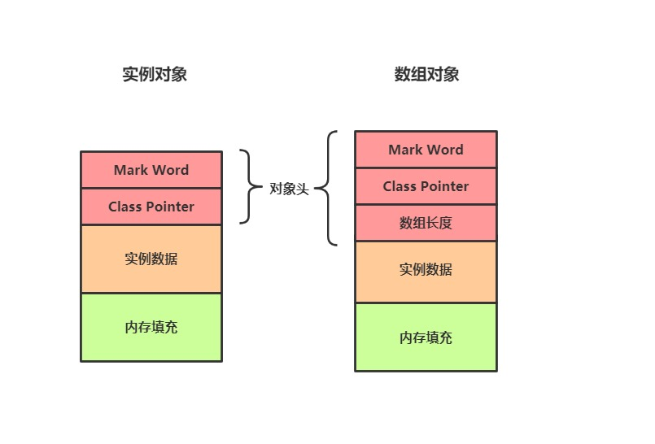
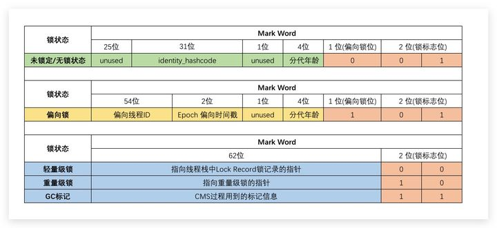
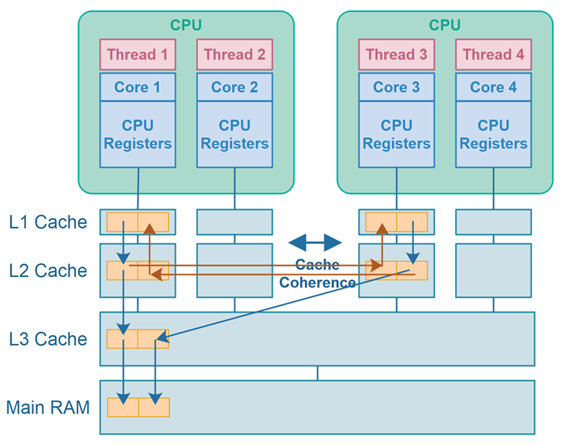
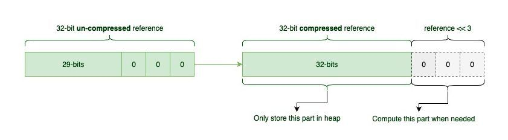

# Java Object Layout

## Java内存布局介绍  
   
   Java的实例对象、数组对象在内存中的组成包括如下三部分：对象头Hearder、实例数据、内存填充。示意图如下所示


对象头：其主要包括两部分数据：Mark Word、Class对象指针。特别地对于数组对象而言，其还包括了数组长度数据。在64位的HotSpot虚拟机下，Mark Word占8个字节，其记录了Hash Code、GC信息、锁信息等相关信息；而Class对象指针则指向该实例的Class对象，在开启指针压缩的情况下占用4个字节，否则占8个字节；如果其是一个数组对象，则还需要4个字节用于记录数组长度信息。这里列出64位HotSpot虚拟机Mark Word的具体含义，以供参考。需要注意的是在下图的Mark Word中，左侧为高字节，右侧为低字节


## 使用工具查看Java内存布局

依赖
```java  
<dependency>
    <groupId>org.openjdk.jol</groupId>
    <artifactId>jol-core</artifactId>
    <version>0.16</version>
</dependency>
```

## 简单使用

```java  
-Djdk.attach.allowAttachSelf
```

```java  
public static void main(String[] args) {
    System.out.println(ClassLayout.parseInstance(new Node()).toPrintable());
}

public static class Node {
    public long value;
}
```

```java  
cn.nextop.gadget.Main$Node object internals:
OFF  SZ   TYPE DESCRIPTION               VALUE
  0   8        (object header: mark)     0x000000000000000d (biasable; age: 1)
  8   4        (object header: class)    0x00066248
 12   4        (alignment/padding gap)   
 16   8   long Node2.value               0
Instance size: 24 bytes
Space losses: 4 bytes internal + 0 bytes external = 4 bytes total
```

## false sharing与缓存行填充



1. [disruptor](https://github.com/LMAX-Exchange/disruptor)

2. 手动填充
```java  

public class LhsPadding
{
    protected byte
        p10, p11, p12, p13, p14, p15, p16, p17,
        p20, p21, p22, p23, p24, p25, p26, p27,
        p30, p31, p32, p33, p34, p35, p36, p37,
        p40, p41, p42, p43, p44, p45, p46, p47,
        p50, p51, p52, p53, p54, p55, p56, p57,
        p60, p61, p62, p63, p64, p65, p66, p67,
        p70, p71, p72, p73, p74, p75, p76, p77;
}

public class Value extends LhsPadding
{
    protected long value;
}

public class RhsPadding extends Value
{
    protected byte
        p90, p91, p92, p93, p94, p95, p96, p97,
        p100, p101, p102, p103, p104, p105, p106, p107,
        p110, p111, p112, p113, p114, p115, p116, p117,
        p120, p121, p122, p123, p124, p125, p126, p127,
        p130, p131, p132, p133, p134, p135, p136, p137,
        p140, p141, p142, p143, p144, p145, p146, p147,
        p150, p151, p152, p153, p154, p155, p156, p157;
}

```

3. 使用Contended注解

```java  
public class Value {
@jdk.internal.vm.annotation.Contended
public long value;
}
```

```java  
-XX:-RestrictContended -XX:ContendedPaddingWidth=64 --add-opens=java.base/jdk.internal.vm.annotation=ALL-UNNAMED
```

```java  
cn.nextop.gadget.Value object internals:
OFF  SZ   TYPE DESCRIPTION               VALUE
  0   8        (object header: mark)     0x000000000000000d (biasable; age: 1)
  8   4        (object header: class)    0x00066248
 12  68        (alignment/padding gap)   
 80   8   long Node2.value               0
 88   0        (object alignment gap)    
Instance size: 152 bytes
Space losses: 68 bytes internal + 0 bytes external = 68 bytes total
```


## 基础类型的包装对象占用的内存空间

```java  
java.lang.Byte object internals:
OFF  SZ   TYPE DESCRIPTION               VALUE
  0   8        (object header: mark)     0x0000000000000005 (biasable; age: 0)
  8   4        (object header: class)    0x00013548
 12   1   byte Byte.value                5
 13   3        (object alignment gap)    
Instance size: 16 bytes
Space losses: 0 bytes internal + 3 bytes external = 3 bytes total
```

```java  
java.lang.Long object internals:
OFF  SZ   TYPE DESCRIPTION               VALUE
  0   8        (object header: mark)     0x000000000000000d (biasable; age: 1)
  8   4        (object header: class)    0x00013c38
 12   4        (alignment/padding gap)   
 16   8   long Long.value                5
Instance size: 24 bytes
Space losses: 4 bytes internal + 0 bytes external = 4 bytes total
```

避免boxing, unboxing

```java  
LongHashMap
LongFunction
...
```

## 压缩指针与object alignment

```java  
-XX:+UseCompressedOops
-XX:ObjectAlignmentInBytes=8
```



```
32位4字节地址可以根据地址后三位为0，那么进行位移操作后可以保存35位地址；即2^35=32g堆空间以内可以使用压缩指针

当-XX:ObjectAlignmentInBytes=16时，那么地址后4位为0， 可以在2^36=64g堆空间内使用压缩指针
```

## 示例

