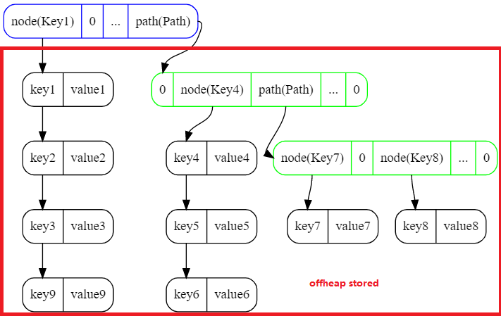
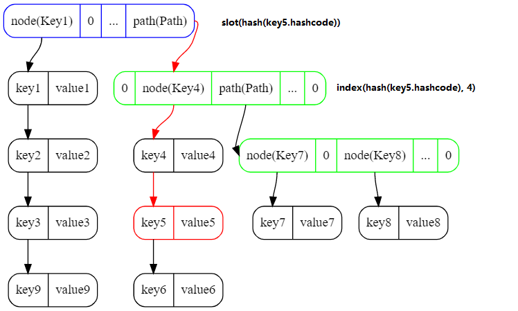
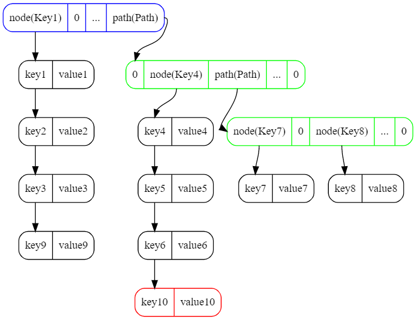
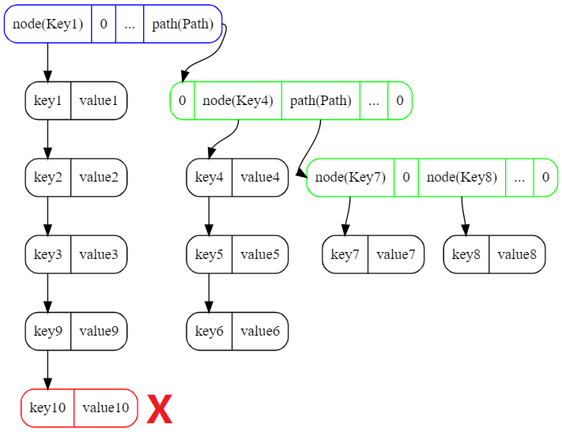
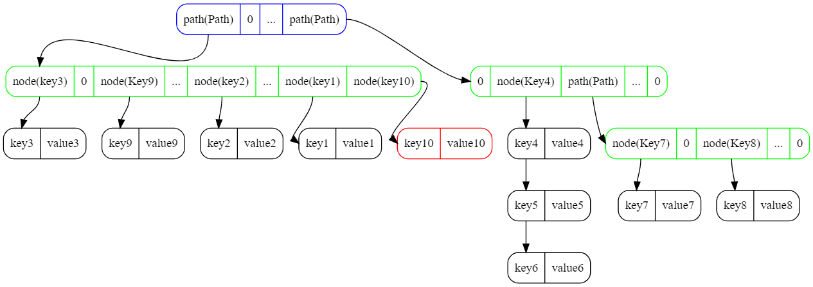
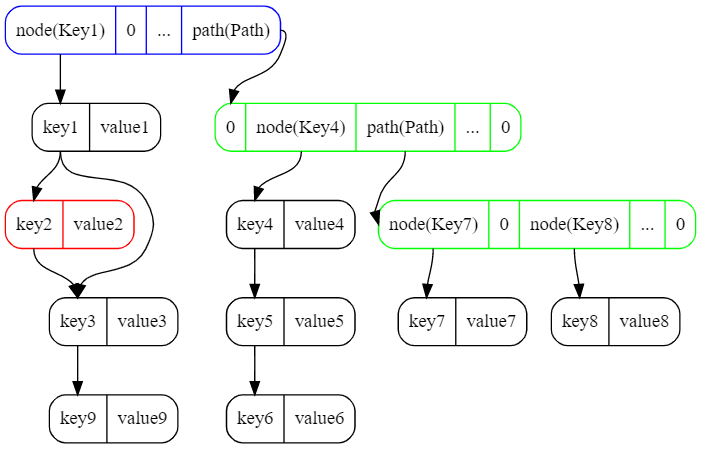
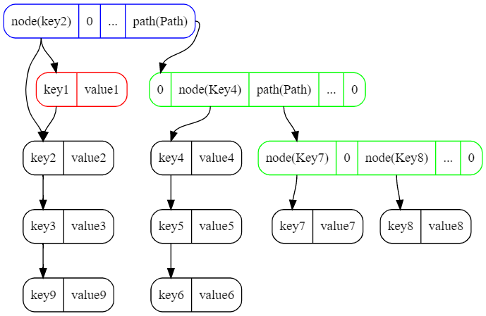
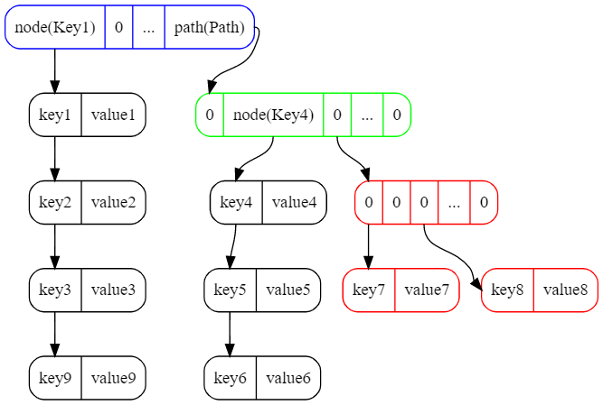
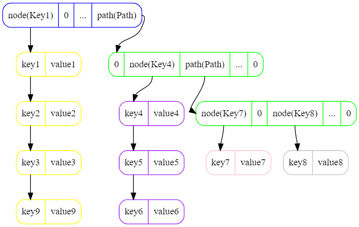
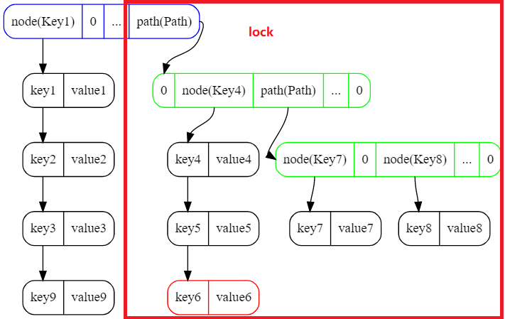

# DirectMap

1. 结构
2. 查找
3. 插入
4. 删除
5. 迭代
6. 线程安全
7. 堆外内存管理
8. 性能基准测试

## 1. 结构



#### 1.1 slot
```
# slot 决定图中root即蓝色框的index
int hash = hash(key.hashcode)
int slot(hash)
    return hash >>> 24
```

#### 1.2 node
```
int length = key.length + value.length
long addr = malloc(length)
put(addr, key, value)

long node(addr)
    return addr << 1 | 0
```

#### 1.3 path
```
int length = 256 * 8
long addr = malloc(length)

long path(addr)
    return addr << 1 | 1
```

#### 1.4 index
```
init level = 3
int hash = hash(key.hashcode)
int index(hash, level)
    return (hash >>> ((level - 1) * 8)) & 0xFF;
```

```
example:
int hash = 01101001||11010100||10110100||10010011

slot = 01101001 & 0xFF
level3's index = 11010100 & 0xFF
level2's index = 10110100 & 0xFF
level1's index = 10010011 & 0xFF
```

## 2. 查找

#### 2.1 查找key5



#### 2.2 查找伪代码
```
get(key)
    hash = hash(key.hashcode)
    slot = slot(hash)
    level = 3
    next = storage.get(root[slot])
    while (next != nil)
        if (next is path)
            index = index(hash, level)
            next = storage.get(path[index])
            level = level - 1
        else if (next is node)
            if (next.key equals key)
                return next.value
            next = storage.get(next.next)
    return nil
```

## 3. 插入

#### 3.1 插入到某一位置


#### 3.2 插入引发的层扩容





#### 3.3 层扩容引发的冲突


#### 3.4 插入伪代码

```
put(key, val) 
    hash = hash(key.hashcode)
    slot = slot(hash)
    next = storage.get(root[slot])
    
    # insert to root
    if (next is nil) 
        addr = insert(key, val)
        root[slot] = node(addr)
        return
    
    # replace exist key's value
    searchPaths = new List
    level = 3
    while (next != nil)
        searchPaths.add(next)
        if (next is path)
            index = index(hash, level)
            next = storage.get(path[index])
            level = level - 1
        else if (next is node)
            if (next.key equals key)
                next.value = val
                return
            next = storage.get(next.next)
        
    # if not found exist key, insert key,val
    if (level <= 0 or nodes < MAX)
        insert(searchPaths, key, val)
        return
    
    # relocated nodes to new path
    path = new Path
    index = index(hash, level)
    path[index] = (key, val)
    relocated(searchPaths, path, level)
    return
```

## 4. 删除

#### 4.1 删除某一结点



#### 4.2 删除的Path的头节点



#### 4.3 删除引发的层缩容



#### 4.4 删除伪代码

```
remove(key)
    hash = hash(key.hashcode)
    slot = slot(hash)
    next = storage.get(root[slot])
    
    searchPaths = new List
    level = 3
    while (next != nil)
        searchPaths.add(next)
        if (next is path)
            index = index(hash, level)
            next = storage.get(path[index])
            level = level - 1
        else if (next is node)
            if (next.key equals key)
                delete(searchPaths, key)
                return
            next = storage.get(next.next)
    return
```

## 5. 迭代

#### 5.1 迭代Map



```
1th iterate [key1, key2, key3, key9]
2th iterate [key4, key5, key6]
3th iterate [key7]
4th iterate [key8]
```

#### 5.2 迭代Map时发生了层扩容

```
1th iterate [key1, key2, key3, key9]
insert key10
2th iterate [key2]  X
3th iterate [key1]  X
4th iterate [key10]
5th iterate [key4, key5, key6]
6th iterate [key7]
7th iterate [key8]
```


```
1th iterate [key3, key9, key2, key1]
insert key10
2th iterate [key10]
3th iterate [key4, key5, key6]
4th iterate [key7]
5th iterate [key8]
```

## 6. 线程安全



```  
get(key)
    int hash = hash(key.hashcode)
    int slot = slot(hash)
    lock[slot].readlock.lock
    try
        value = lookup(key)
        return value;
    finally 
        lock[slot].readlock.unlock

put(key, value)
    int hash = hash(key.hashcode)
    int slot = slot(hash)
    lock[slot].writelock.lock
    try
        oldvalue = insert(key, value)
        return oldvalue
    finally 
        lock[slot].writelock.unlock
```

## 7. 堆外内存管理

#### 7.1 Path 压缩

```
# 未优化需要像堆外写入256 * 8 字节
int length = 256 * 8
long addr = malloc(length)

# 使用位图压缩示例

byte[] ary = {0, 0, 127, 0, 34, 0, 0, 0}
byte header = 00101000
byte[] value = {127, 34}

long addr = malloc(header + value.length)
put(addr, header)
put(addr + 1, 127)
put(addr + 2, 34)

# 优化后写入4 * 8 + values.length * 8字节
```

#### 7.2 Path, Node内存分配策略

```
if (newlen <= oldlen / 2 or newlen > oldlen)
    addr = realloc(addr, newlen)
```

#### 7.3 反序列化与Lazy get

```
get(key)
    hash = hash(key.hashcode)
    slot = slot(hash)
    level = 4
    next = storage.get(root[slot])
    while(next != nil)
        if (next is path)
            index = index(hash, level)
            // path lazy get
            next = storage.get(path[index])
            level = level - 1
        else if (next is node)
            if (next.key equals key)
                // unmarshall value when match the key.
                return next.value
            next = storage.get(next.next)
    return nil
```

#### 7.4 内存利用率

| Key Number | Allocated | Utilization |
|------------|-----------|-------------|
| 100000     | 12547K    | 0.94951445  |
| 200000     | 25621K    | 0.93001527  |
| 320000     | 42334K    | 0.90057003  |
| 400000     | 53580K    | 0.88943195  |
| 500000     | 67415K    | 0.88363045  |


## 8. 性能基准测试

```
Benchmark                                   Mode  Cnt         Score         Error  Units
XDirectMapBenchmark.benchMapdbGet          thrpt    5    596524.301 ±   54782.085  ops/s
XDirectMapBenchmark.benchMapdbPut          thrpt    5    194344.074 ±   10681.119  ops/s

XDirectMapBenchmark.benchChronicleMapGet   thrpt    5   2534841.415 ±   93308.128  ops/s
XDirectMapBenchmark.benchChronicleMapPut   thrpt    5    455725.397 ±   37235.009  ops/s

XDirectMapBenchmark.benchDirectGet         thrpt    5   4425757.740 ±  218460.919  ops/s
XDirectMapBenchmark.benchDirectPut         thrpt    5   1114607.063 ±   33059.736  ops/s

XDirectMapBenchmark.benchNopLockDirectGet  thrpt    5   4711437.701 ± 1359401.593  ops/s
XDirectMapBenchmark.benchNopLockDirectPut  thrpt    5   1120465.074 ±   92480.872  ops/s

XDirectMapBenchmark.benchJavallocGet       thrpt    5  10082063.184 ± 1298667.899  ops/s
XDirectMapBenchmark.benchJavallocPut       thrpt    5   1360898.468 ±   40137.344  ops/s
```