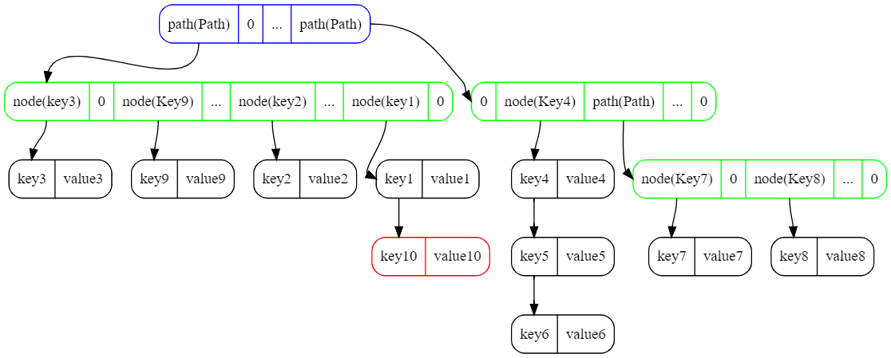

# DirectMap

1. 结构
2. 查找
3. 插入
4. 删除
5. 迭代
6. 线程安全
7. 堆外内存管理
8. mapdb的hash操作
9. 性能基准测试

## 1. 结构


#### 1.1 node 函数
```
int length = key.length + value.length
long addr = malloc(length)
put(addr, key, value)

long node(addr) {
    return addr << 1 | 0
}
```

#### 1.2 path 函数
```
int length = 1288
long addr = malloc(length)

long path(addr) {
    return addr << 1 | 1
}
```

#### 1.3 slot 函数
```
# slot 函数决定图中root即蓝色框的index
init slots = 32
int hash = hash(key.hashcode)
int slot(hash) {
    return hash & 31
}
```

#### 1.4 index 函数
```
# index 函数决定图中path即绿色框的index
init level = 4
int hash = hash(key.hashcode)
int index(hash, level) {
    return (hash >>> ((level - 1)8)) & 127;
}
```

```
example:
int hash = 01101001||11010100||10110100||10010011
if level = 4 then index = 01101001 & 127
if level = 3 then index = 11010100 & 127
if level = 2 then index = 10110100 & 127
if level = 1 then index = 10010011 & 127
```

## 2. 查找

#### 2.1 查找key5


#### 2.2 查找伪代码
```
get(key) {
    hash = hash(key.hashcode)
    slot = hash & mask
    level = 4
    next = storage.get(root[slot])
    while(next != nil) {
        if (next is path) {
            index = index(hash, level)
            next = storage.get(path[index])
            level = level - 1
        } else if (next is node) {
            if (next.key equals key) {
                return next.value
            }
            next = storage.get(next.next)
        }
    }
    return nil
}
```

## 3. 插入

#### 3.1 插入到某一位置


#### 3.2 插入引发的层扩容


#### 3.3 层扩容引发的冲突



## 4. 删除

#### 4.1 删除某一结点


#### 4.2 删除的Path的头节点


#### 4.3 删除引发的层缩容


## 5. 迭代

#### 5.1 迭代Map


```
1th iterate [key1, key2, key3, key9]
2th iterate [key4, key5, key6]
3th iterate [key7]
4th iterate [key8]
```

#### 5.2 迭代Map时发生了层扩容

```
1th iterate [key1, key2, key3, key9]
insert key10
2th iterate [key2]  X
3th iterate [key1]  X
4th iterate [key10]
5th iterate [key4, key5, key6]
6th iterate [key7]
7th iterate [key8]
```


```
1th iterate [key3, key9, key2, key1]
insert key10
2th iterate [key10]
3th iterate [key4, key5, key6]
4th iterate [key7]
5th iterate [key8]
```

## 6. 线程安全


```java  
DirectMap<Integer, Integer> map = new DirectMap<>(32);
get(key) {
    int hash = hash(key.hashcode)
    int slot = hash & 31;
    lock[slot].readlock.lock
    // find that key's value in the search tree
    value = lookup(key)
    finally lock[slot].readlock.unlock
    return value
}

put(key, value) {
    int hash = hash(key.hashcode)
    int slot = hash & 31;
    lock[slot].writelock.lock
    // insert key and value to the search tree
    oldvalue = insert(key, value)
    finally lock[slot].writelock.unlock
    return oldvalue
}

```


## 7. 堆外内存管理

#### 7.1 Path 压缩

```
int length = 1288
long addr = malloc(length)

(1)
long[] header = new long[2]
int length = count(header);
long[] values = new long[length]

long addr = malloc(2*8 + values.length*8);
put(addr, header)
put(addr, values)

(2)
long[] header = new long[2]
int length = count(header);
length = Math.max(po2(length), 16);
long[] values = new long[length]

long addr = malloc(2*8 + values.length*8);
put(addr, header)
put(addr, values)
```

#### 7.2 Path, Node内存分配策略

```
if (newlen <= oldlen / 2 || newlen > oldlen) {
    addr = allocator.realloc(addr, newlen);
}
```

#### 7.3 反序列化与Value Lazy get

```
get(key) {
    hash = hash(key.hashcode)
    slot = hash & mask
    locks[slot].readlock.lock
    level = 4
    next = storage.get(root[slot])
    while(next != nil) {
        if (next is path) {
            index = index(hash, level)
            next = storage.get(path[index])
            level = level - 1
        } else if (next is node) {
            if (next.key equals key) {
                // unmarshall value when match the key.
                return next.value
            }
            next = storage.get(next.next)
        }
    }
    return nil
    finally locks[slot].readlock.unlock
}
```

## 8. mapdb的hash操作

```
init level = 4
int hash = hash(key.hashcode)
int index(hash, level) {
    return (hash >>> ((level - 1)7)) & 127;
}
```

```
example:
int hash = 0110||1001110||1010010||1101001||0010011
int slot = 0110 & 15
if level = 4 then index = 1001110 & 127
if level = 3 then index = 1010010 & 127
if level = 2 then index = 1101001 & 127
if level = 1 then index = 0010011 & 127
```

## 9. 性能基准测试

```
Benchmark                              Mode  Cnt         Score        Error  Units
XDirectMapBenchmark.benchDirectGet    thrpt    5   3314123.305 ± 123395.048  ops/s
XDirectMapBenchmark.benchMapdbGet     thrpt    5    684125.877 ± 104299.890  ops/s
XDirectMapBenchmark.benchJemallocGet  thrpt    5  11175422.222 ± 537431.905  ops/s
XDirectMapBenchmark.benchOakGet       thrpt    5    180117.220 ±  52702.784  ops/s
XDirectMapBenchmark.benchOakZcGet     thrpt    5    216160.772 ±  88158.235  ops/s

XDirectMapBenchmark.benchDirectPut    thrpt    5    528279.275 ±  12701.195  ops/s
XDirectMapBenchmark.benchMapdbPut     thrpt    5    275432.266 ± 127542.606  ops/s
XDirectMapBenchmark.benchJemallocPut  thrpt    5    962102.121 ±  14491.815  ops/s
XDirectMapBenchmark.benchOakPut       thrpt    5    469686.177 ± 122307.884  ops/s
XDirectMapBenchmark.benchOakZcPut     thrpt    5    633389.915 ±  36848.268  ops/s
```